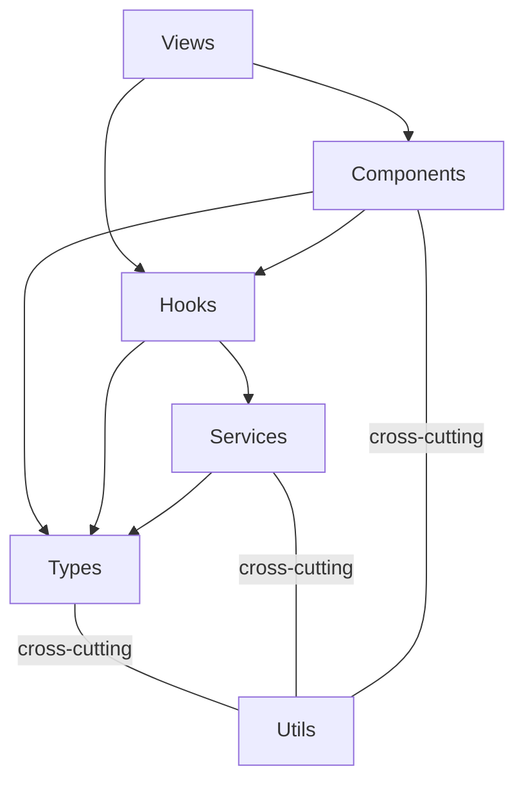

# Architecture — func-console

## Stack

React + TypeScript + PatternFly 6 + OCP Dynamic Plugin SDK

## Layered Architecture

Arrows mean "imports / depends on."

| Layer | Maps to | Depends on |
|-------|---------|------------|
| **Types** | `services/types.ts` | nothing |
| **Services** | `services/*/Service.ts` + implementations | Types, Utils |
| **Hooks** | `services/*/use*.ts` — wiring layer | Services, Types, Utils |
| **Components** | `components/` — FunctionTable, CreateForm, etc. | Hooks, Types, Utils |
| **Views** | `views/` — page-level components | Components, Hooks, Utils |
| **Utils** | `utils/` — constants, helpers | nothing (cross-cutting) |

### Dependency Rules

- Unidirectional: Types <- Services <- Hooks <- Components <- Views
- Utils can be imported by any layer
- Views never import Services directly (always through Hooks)
- Services never import Components or Views
- No circular dependencies

## Page / Component / Hook Rules

**Components are simple** — they receive data via props, render it, and call callbacks to return data to the parent (or use context). No logic at the top of a component.

**Pages are smart** — they use central hooks (e.g. `useClusterService`, `useSourceControl`) to fetch, prepare, and transform all data needed for downstream components.

**Extract logic into hooks** — if a page or component has any logic (state management, data transformation, side effects), extract it into a co-named hook: `FunctionTable.tsx` → `useFunctionTable.ts`, `FunctionsListPage.tsx` → `useFunctionsListPage.ts`. If there is no logic, no hook is needed.

## Architectural Guidance

- PatternFly components preferred over custom HTML
- Error handling through ErrorProvider/addError pattern
- Shared utilities in `utils/`, not hand-rolled per component
- Services consumed through hooks, never imported directly
